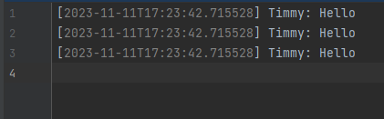
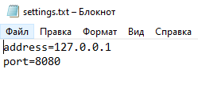

# Network Chat

#### Программа представляет собой чат-приложение, включающее сервер (Server) и клиент (Client). Пользователи могут подключаться к серверу и обмениваться сообщениями в режиме реального времени.

### Server (Сервер):

#### 1.  loadSettings():
Метод loadSettings загружает настройки сервера из файла settings.txt, который должен содержать параметры порта (port).

#### 2. start(): 
Метод start инициализирует серверный сокет на указанном порту и ожидает подключения клиентов/

Как только клиент подключается, создается новый экземпляр ServerThread (поток для обработки клиента) и добавляется в список подключенных клиентов.  Каждый клиент обрабатывается в отдельном потоке.

#### 3. ServerThread
(Поток сервера для клиента): Этот вложенный класс представляет собой поток, который обрабатывает подключенного клиента. Каждый поток создается при подключении нового клиента.

#### 4. run():
Метод run выполняет основную логику для каждого подключенного клиента. Читается имя пользователя, и затем сервер начинает принимать сообщения от клиента. Полученные сообщения выводятся в консоль сервера,

логируются в файл file.log

и отправляются всем подключенным клиентам.

#### 5. sendToAllClients():
Метод sendToAllClients отправляет сообщение всем остальным подключенным клиентам.

### Client (Клиент):

#### 1. loadSettings():
Метод loadSettings загружает настройки клиента из файла settings.txt, который должен содержать параметры адреса сервера (address) и порта (port).

#### 2. start():
Метод start инициализирует соединение с сервером через сокет, создает буферные читатели и писатели для ввода/вывода, и запускает поток (incomingThread), который читает сообщения от сервера и выводит их в консоль клиента. Затем клиент вводит свое имя, которое отправляется на сервер. После этого клиент может отправлять сообщения на сервер. Ввод /exit завершит выполнение программы.

##### Программа предоставляет простое текстовое взаимодействие между сервером и клиентами, с возможностью подключения нескольких клиентов и обмена сообщениями в реальном времени.